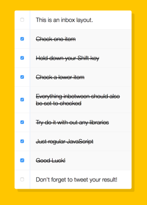

## JavaScript30 Day 10 - Hold Shift And Check Checkboxes

In this tutorial, we learn how to use JavaScript to enable multiple check checkboxes by holding down shift key.

[View demo site here.](https://webdevtuts.github.io/javascript30_10/)

